<p align="center">
  <a href="http://nestjs.com/" target="blank"></a>
</p>

[circleci-image]: https://img.shields.io/circleci/build/github/nestjs/nest/master?token=abc123def456
[circleci-url]: https://circleci.com/gh/nestjs/nest

  <p align="center">A progressive <a href="http://nodejs.org" target="_blank">Node.js</a> framework for building efficient and scalable server-side applications.</p>
    <p align="center">
<a href="https://www.npmjs.com/~nestjscore" target="_blank"></a>
<a href="https://www.npmjs.com/~nestjscore" target="_blank"></a>
<a href="https://www.npmjs.com/~nestjscore" target="_blank"></a>
<a href="https://circleci.com/gh/nestjs/nest" target="_blank"></a>
<a href="https://discord.gg/G7Qnnhy" target="_blank"></a>
<a href="https://opencollective.com/nest#backer" target="_blank"></a>
<a href="https://opencollective.com/nest#sponsor" target="_blank"></a>
  <a href="https://paypal.me/kamilmysliwiec" target="_blank"></a>
    <a href="https://opencollective.com/nest#sponsor"  target="_blank"></a>
  <a href="https://twitter.com/nestframework" target="_blank"></a>
</p>
  <!--[](https://opencollective.com/nest#backer)
  [](https://opencollective.com/nest#sponsor)-->

## Description

[Nest](https://github.com/nestjs/nest) framework TypeScript starter repository.

## Database Schema

The application database is defined with Prisma under `prisma/schema.prisma` and `prisma/models/*.prisma`.
GitHub renders the Mermaid diagram below directly in the README.

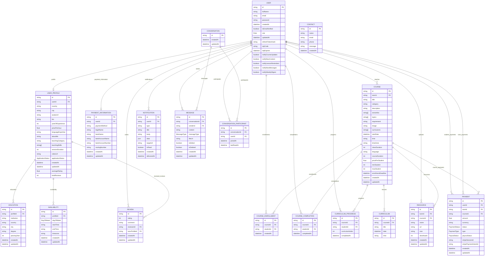

### Enums

- `Role`: `STUDENT`, `TUTOR`, `ADMIN`
- `ApplicationStatus`: `DRAFT`, `PENDING`, `APPROVED`, `REJECTED`
- `DayOfWeek`: `MONDAY`, `TUESDAY`, `WEDNESDAY`, `THURSDAY`, `FRIDAY`, `SATURDAY`, `SUNDAY`
- `PaymentStatus`: `PENDING`, `PAID`, `FAILED`, `CANCELLED`
- `PaymentType`: `GROUP`, `PRIVATE`
- `PayoutStatus`: `PENDING`, `PAID`
- `MessageType`: `TEXT`, `IMAGE`, `FILE`

## Backend Features

- JWT-based authentication for register, login, forgot password, reset password, and account deletion
- Role-based access control for `STUDENT`, `TUTOR`, and `ADMIN`
- Tutor profile management with availability, education, skills, pricing, and application status
- Admin review and approval flow for tutor applications
- Course creation, update, deletion, listing, and upcoming course discovery
- Student course enrollment and curriculum completion tracking
- Tutor class management for enrolled students, lesson overview, and course resources
- Stripe-powered checkout sessions for group courses and private tutoring
- Payment tracking for student and tutor transactions, dashboard summaries, and webhook processing
- Tutor dashboard analytics for revenue, students, lessons, notifications, and recent activity
- Real-time chat with conversations, messages, read status, and WebSocket support
- Review and rating system for tutors
- Resource upload and management for tutors and courses
- Settings management for tutor payment information and password changes
- Contact form submission and contact inquiry listing
- User and tutor administration endpoints for listing, filtering, and account management

## Backend Workflows

The workflow appendix below is organized by user journey. Each section lists every route involved, then shows a compact Mermaid traversal plus one representative request and response sample.

<details>
<summary>1. Guest User Registration</summary>

Purpose: A guest signs up, the role is normalized to Prisma enums, and a profile row is created with the initial application status.

Routes: `POST /auth/register`

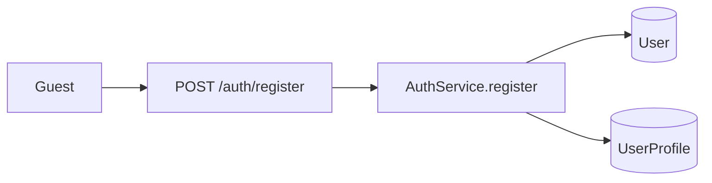

Request:
```http
POST /auth/register
Content-Type: application/json

{
  "fullName": "John Doe",
  "email": "john.doe@example.com",
  "password": "securePassword123",
  "role": "STUDENT"
}
```

Response:
```json
{
  "success": true,
  "message": "Registration successful",
  "data": {
    "id": "user_uuid",
    "email": "john.doe@example.com",
    "fullName": "John Doe",
    "role": "STUDENT",
    "profile": {
      "applicationStatus": "APPROVED"
    }
  }
}
```
</details>

<details>
<summary>2. Login and Session</summary>

Purpose: The user logs in, gets JWT tokens, and the backend stores a hashed refresh token for later session control.

Routes: `POST /auth/login`

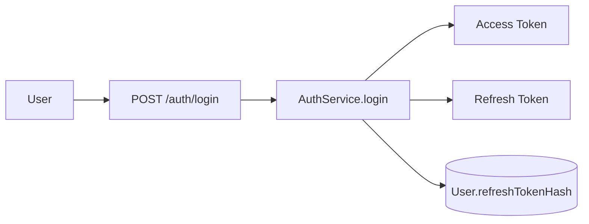

Request:
```http
POST /auth/login
Content-Type: application/json

{
  "email": "john.doe@example.com",
  "password": "securePassword123"
}
```

Response:
```json
{
  "success": true,
  "message": "Login successful",
  "accessToken": "eyJhbGciOiJIUzI1NiIs...",
  "refreshToken": "eyJhbGciOiJIUzI1NiIs...",
  "user": {
    "id": "user_uuid",
    "email": "john.doe@example.com",
    "fullName": "John Doe",
    "role": "STUDENT"
  }
}
```
</details>

<details>
<summary>3. Password Recovery</summary>

Purpose: The user requests an OTP, verifies it, and sets a new password before the OTP expires.

Routes: `POST /auth/forgot-password`, `POST /auth/reset-password`

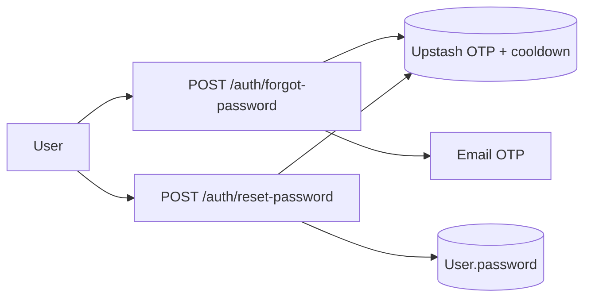

Request:
```http
POST /auth/reset-password
Content-Type: application/json

{
  "email": "john.doe@example.com",
  "otp": "123456",
  "newPassword": "newSecurePassword123"
}
```

Response:
```json
{
  "success": true,
  "message": "Password reset successful"
}
```
</details>

<details>
<summary>4. Logout</summary>

Purpose: The authenticated user logs out, cookies are cleared, and the refresh session is invalidated.

Routes: `POST /auth/logout`

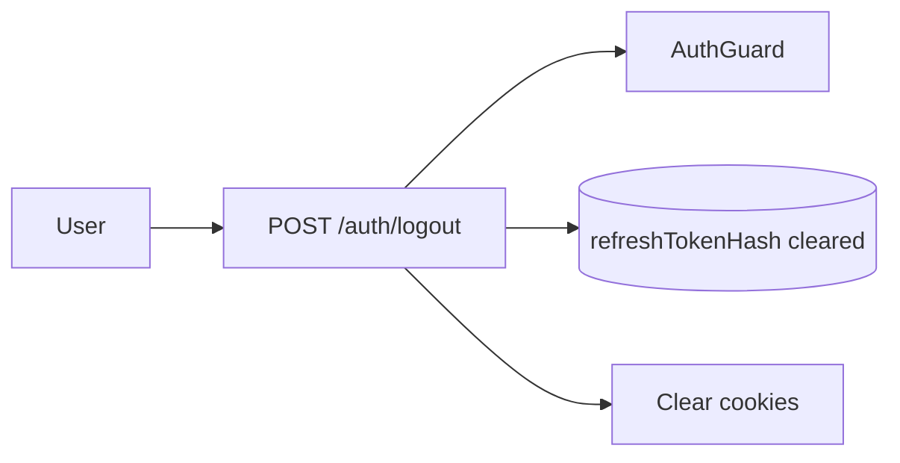

Request:
```http
POST /auth/logout
Authorization: Bearer <accessToken>
```

Response:
```json
{
  "success": true,
  "message": "Logout successful"
}
```
</details>

<details>
<summary>5. Account Deletion</summary>

Purpose: The authenticated user deletes the account, the session is invalidated, and auth cookies are cleared.

Routes: `DELETE /auth/me`

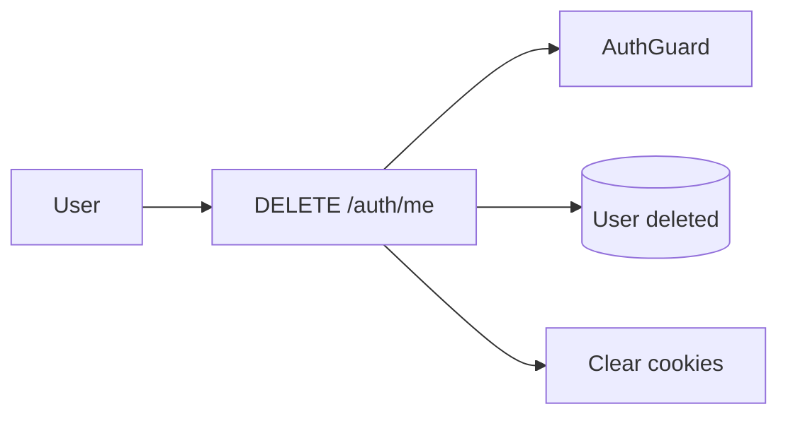

Request:
```http
DELETE /auth/me
Authorization: Bearer <accessToken>
```

Response:
```json
{
  "success": true,
  "message": "Account deleted successfully"
}
```
</details>

<details>
<summary>6. Public Profile Creation</summary>

Purpose: A profile can be created before the authenticated edit flow, which is useful during onboarding.

Routes: `POST /profile/create`

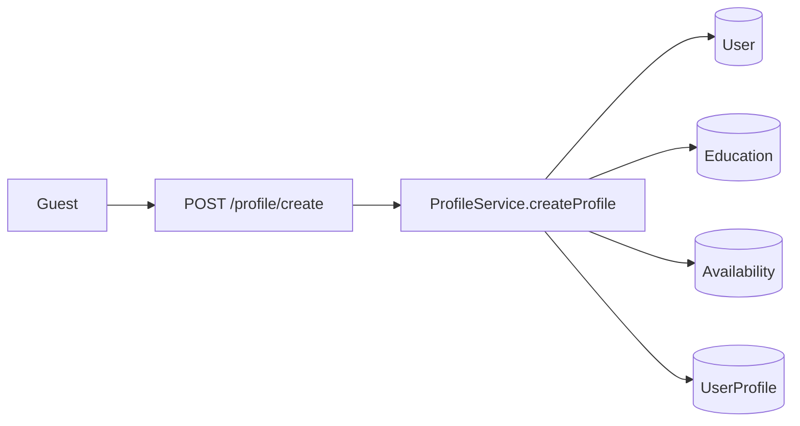

Request:
```http
POST /profile/create
Content-Type: application/json

{
  "userId": "user_uuid",
  "fullName": "Jane Tutor",
  "country": "Bangladesh",
  "city": "Dhaka",
  "teachingCategory": "Mathematics",
  "teachingSkills": ["Algebra", "Calculus"],
  "education": [{ "institution": "Dhaka University", "passingYear": 2022 }],
  "availability": [{ "dayOfWeek": "MONDAY", "startTime": "09:00", "endTime": "17:00", "timezone": "Asia/Dhaka" }]
}
```

Response:
```json
{
  "success": true,
  "message": "Profile created successfully",
  "data": {
    "userId": "user_uuid",
    "teachingCategory": "Mathematics"
  }
}
```
</details>

<details>
<summary>7. My Profile</summary>

Purpose: The authenticated user fetches their own profile, including education, availability, and tutor stats.

Routes: `GET /profile/my`

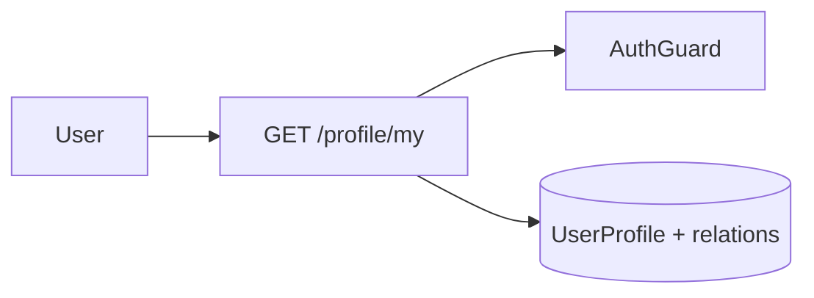

Request:
```http
GET /profile/my
Authorization: Bearer <accessToken>
```

Response:
```json
{
  "id": "profile_uuid",
  "userId": "user_uuid",
  "teachingCategory": "Mathematics",
  "education": [],
  "availability": [],
  "completedCoursesCount": 3
}
```
</details>

<details>
<summary>8. Public Tutor Profile</summary>

Purpose: Anyone can inspect a tutor profile and their availability before booking or enrolling.

Routes: `GET /profile/tutor/:userId`, `GET /profile/:tutorId/availability`

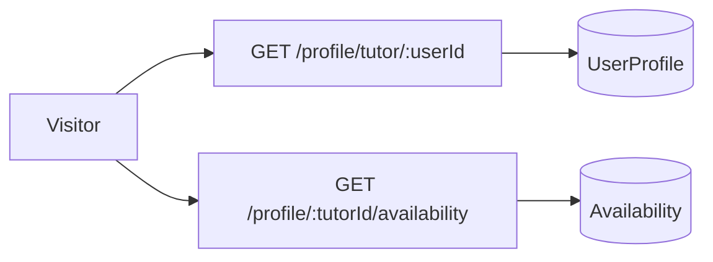

Request:
```http
GET /profile/tutor/user_uuid
```

Response:
```json
{
  "id": "profile_uuid",
  "userId": "user_uuid",
  "avatarUrl": "https://cdn.example.com/avatar.png",
  "teachingCategory": "Mathematics"
}
```
</details>

<details>
<summary>9. Profile Update</summary>

Purpose: The logged-in user updates profile content, education, and availability.

Routes: `PATCH /profile/update`

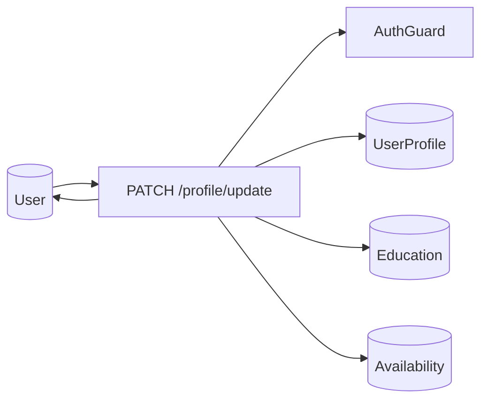

Request:
```http
PATCH /profile/update
Authorization: Bearer <accessToken>
Content-Type: application/json

{
  "bio": "Math tutor with 5 years of experience.",
  "yearOfExperience": 5,
  "education": [{ "institution": "Dhaka University", "passingYear": 2022 }]
}
```

Response:
```json
{
  "success": true,
  "message": "Profile updated successfully",
  "data": {
    "id": "profile_uuid",
    "bio": "Math tutor with 5 years of experience."
  }
}
```
</details>

<details>
<summary>10. Tutor Application Approval</summary>

Purpose: An admin approves or rejects tutor applications by updating the tutor profile status.

Routes: `PATCH /users/profiles/:profileId/status`

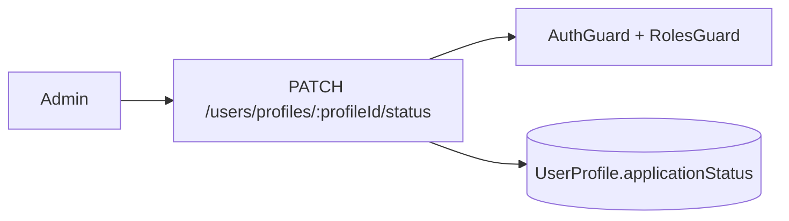

Request:
```http
PATCH /users/profiles/profile_uuid/status
Authorization: Bearer <adminToken>
Content-Type: application/json

{
  "status": "APPROVED"
}
```

Response:
```json
{
  "success": true,
  "message": "Application status updated to APPROVED successfully",
  "data": {
    "id": "profile_uuid",
    "applicationStatus": "APPROVED"
  }
}
```
</details>

<details>
<summary>11. User Directory</summary>

Purpose: The backend exposes the full user directory and a tutor catalog sorted by rating.

Routes: `GET /users`, `GET /users/tutors`, `GET /users/:id`

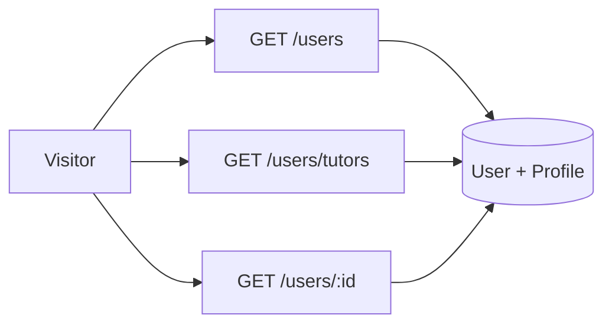

Request:
```http
GET /users/tutors?page=1
```

Response:
```json
{
  "success": true,
  "meta": { "page": 1, "limit": 6, "total": 12, "totalPages": 2 },
  "data": [
    {
      "id": "user_uuid",
      "fullName": "Jane Tutor",
      "profile": { "averageRating": 4.9, "completedCoursesCount": 3 }
    }
  ]
}
```
</details>

<details>
<summary>12. Tutor Student Roster</summary>

Purpose: A tutor views students tied to their courses or private sessions, inspects one student, or removes one from a roster.

Routes: `GET /users/tutor/students`, `GET /users/tutor/students/:studentId`, `DELETE /users/tutor/students/:studentId`

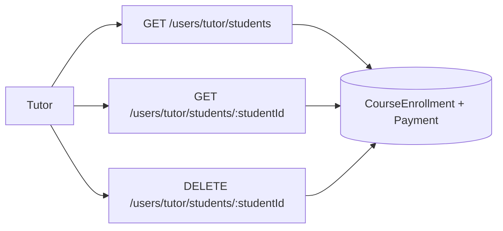

Request:
```http
GET /users/tutor/students?page=1&limit=10&type=all
Authorization: Bearer <tutorToken>
```

Response:
```json
{
  "success": true,
  "meta": { "page": 1, "limit": 10, "total": 5 },
  "data": [
    {
      "id": "student_uuid",
      "fullName": "Student One",
      "email": "student@example.com"
    }
  ]
}
```
</details>

<details>
<summary>13. Course Discovery</summary>

Purpose: Users browse all courses or filter upcoming courses by subject, price, and date.

Routes: `GET /course/upcoming`, `GET /course/all`, `GET /course/:id`

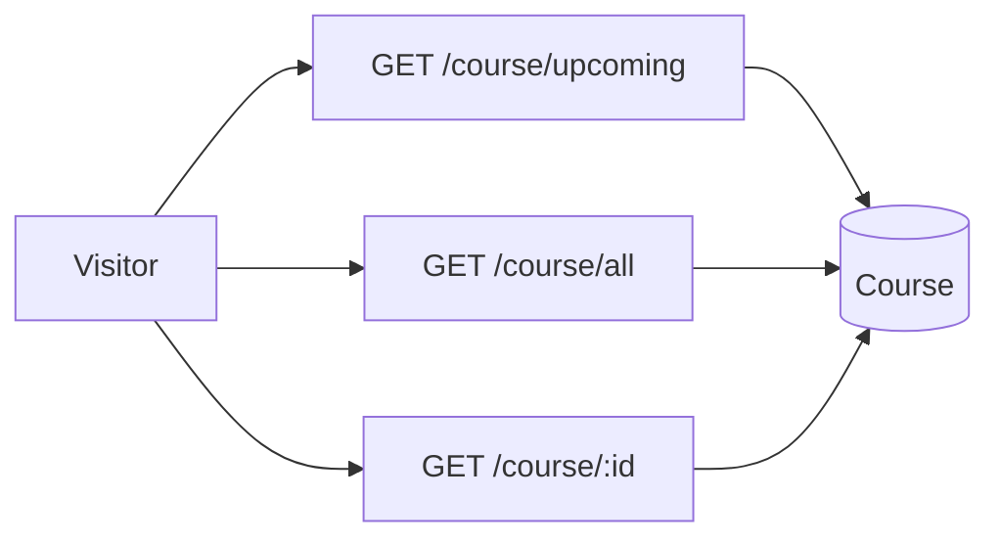

Request:
```http
GET /course/upcoming?subject=Mathematics&price=$0%20-%20$40/hr&date=This%20Month
```

Response:
```json
{
  "success": true,
  "data": [
    {
      "id": "course_uuid",
      "title": "Algebra Basics",
      "pricePerStudent": 25,
      "startDate": "2026-06-15T00:00:00.000Z"
    }
  ]
}
```
</details>

<details>
<summary>14. Course Management</summary>

Purpose: Tutors or admins create and manage courses, and students enroll in available courses.

Routes: `POST /course/create`, `POST /course/:id/enroll`, `PATCH /course/:id`, `DELETE /course/:id`

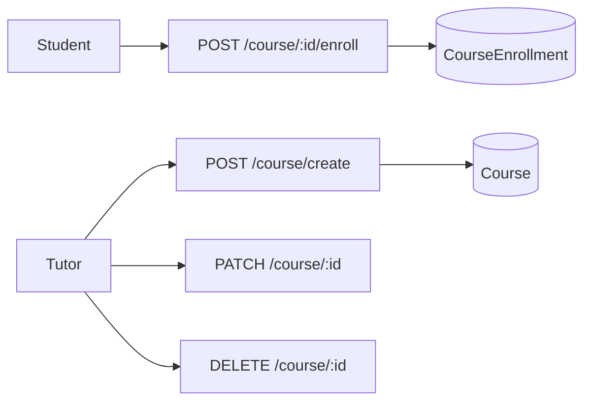

Request:
```http
POST /course/create
Authorization: Bearer <tutorToken>
Content-Type: application/json

{
  "title": "Algebra Basics",
  "category": "Mathematics",
  "description": "Introductory algebra course",
  "extraInfos": ["Live class"],
  "topics": ["Variables", "Equations"],
  "curriculums": ["Intro", "Practice", "Quiz"],
  "startDate": "2026-06-15",
  "time": "10:00",
  "timeZone": "Asia/Dhaka",
  "classDuration": 60,
  "language": "English",
  "courseDuration": 4,
  "pricePerStudent": 25,
  "minStudent": 1,
  "maxStudent": 20,
  "enrollmentDeadline": "2026-06-10"
}
```

Response:
```json
{
  "success": true,
  "message": "Course created successfully",
  "data": {
    "id": "course_uuid",
    "title": "Algebra Basics"
  }
}
```
</details>

<details>
<summary>15. Curriculum Completion</summary>

Purpose: A student marks a class as completed, progress is tracked, and a full course completion record is created when all lessons are done.

Routes: `POST /course/:id/curriculums/:curriculumIndex/complete`

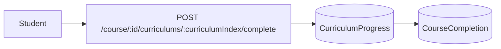

Request:
```http
POST /course/course_uuid/curriculums/0/complete
Authorization: Bearer <studentToken>
```

Response:
```json
{
  "success": true,
  "message": "Curriculum completed successfully"
}
```
</details>

<details>
<summary>16. Class Management</summary>

Purpose: Tutors inspect class data, lessons, enrolled students, and attached resources for a specific course.

Routes: `GET /classes/:courseId/meta`, `GET /classes/:courseId/overview`, `GET /classes/:courseId/students`, `GET /classes/:courseId/enrolled-students`, `DELETE /classes/:courseId/enrolled-students/:studentId`, `GET /classes/:courseId/lessons`, `GET /classes/:courseId/resources`, `POST /classes/:courseId/resources`, `DELETE /classes/:courseId/resources/:resourceId`

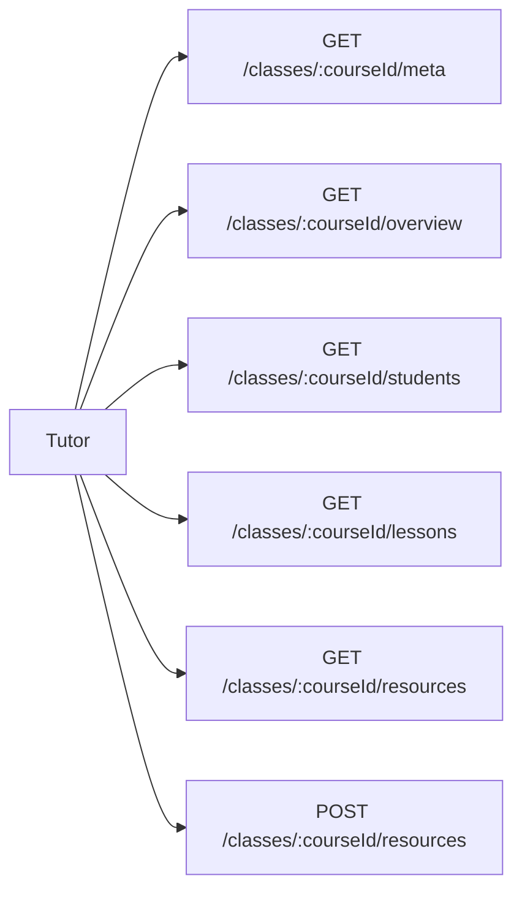

Request:
```http
GET /classes/course_uuid/meta
Authorization: Bearer <tutorToken>
```

Response:
```json
{
  "success": true,
  "data": {
    "enrolledStudents": 12,
    "totalEarning": 300,
    "nextLesson": {
      "id": "course_uuid-0",
      "title": "Intro"
    }
  }
}
```
</details>

<details>
<summary>17. Resource Management</summary>

Purpose: Tutors and admins manage standalone resources attached to their account or courses.

Routes: `POST /resource`, `GET /resource/my`, `PATCH /resource/:id`, `DELETE /resource/:id`

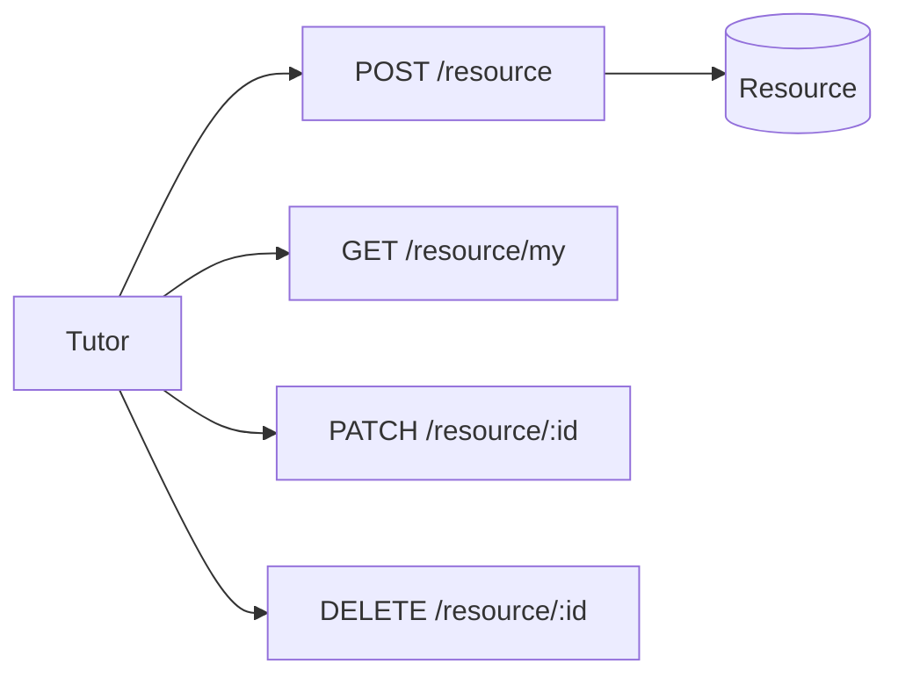

Request:
```http
POST /resource
Authorization: Bearer <tutorToken>
Content-Type: application/json

{
  "name": "Lesson Notes",
  "url": "https://storage.example.com/notes.pdf",
  "size": "2 MB"
}
```

Response:
```json
{
  "success": true,
  "message": "Resource created successfully",
  "data": {
    "id": "resource_uuid",
    "name": "Lesson Notes"
  }
}
```
</details>

<details>
<summary>18. Stripe Checkout</summary>

Purpose: A student creates a Stripe checkout session for a group course or a private tutor booking.

Routes: `POST /payment/create-checkout-session`

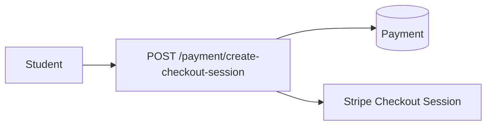

Request:
```http
POST /payment/create-checkout-session
Authorization: Bearer <studentToken>
Content-Type: application/json

{
  "courseId": "course_uuid"
}
```

Response:
```json
{
  "success": true,
  "message": "Checkout session created successfully",
  "data": {
    "payment": { "id": "payment_uuid", "status": "PENDING" },
    "sessionId": "cs_test_123",
    "url": "https://checkout.stripe.com/..."
  }
}
```
</details>

<details>
<summary>19. Stripe Webhook</summary>

Purpose: Stripe notifies the backend about checkout completion or failure, and the backend updates payment state and enrollments.

Routes: `POST /payment/webhook`

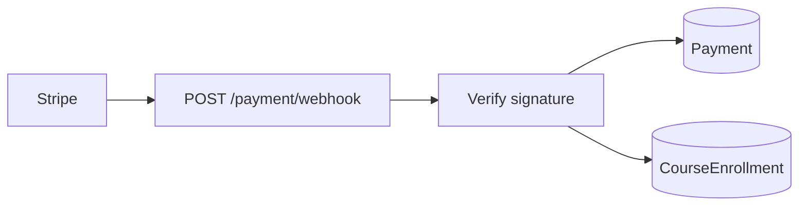

Request:
```http
POST /payment/webhook
Stripe-Signature: t=...

<raw Stripe event body>
```

Response:
```json
{
  "received": true
}
```
</details>

<details>
<summary>20. Student Payment View</summary>

Purpose: A student reviews their own payment list and dashboard aggregates.

Routes: `GET /payment/my`, `GET /payment/student/dashboard/meta`, `GET /payment/student/dashboard/transactions`, `GET /payment/:id`

```mermaid
flowchart LR
  Student --> My[GET /payment/my]
  Student --> Meta[GET /payment/student/dashboard/meta]
  Student --> Tx[GET /payment/student/dashboard/transactions]
  Student --> One[GET /payment/:id]
  My --> Payment[(Payment)]
```

Request:
```http
GET /payment/student/dashboard/meta
Authorization: Bearer <studentToken>
```

Response:
```json
{
  "success": true,
  "data": {
    "cards": {
      "totalSpent": { "amount": 150, "paymentCount": 3 },
      "totalCourses": { "count": 2, "enrolledThisMonth": 1 },
      "thisMonth": { "amount": 25, "paymentCount": 1 }
    }
  }
}
```
</details>

<details>
<summary>21. Tutor Earnings View</summary>

Purpose: A tutor reviews revenue dashboard data and paginated payment history.

Routes: `GET /payment/tutor/dashboard/meta`, `GET /payment/tutor/dashboard/transactions`

```mermaid
flowchart LR
  Tutor --> Meta[GET /payment/tutor/dashboard/meta]
  Tutor --> Tx[GET /payment/tutor/dashboard/transactions]
  Meta --> Payment[(Payment)]
  Tx --> Payment
```

Request:
```http
GET /payment/tutor/dashboard/meta
Authorization: Bearer <tutorToken>
```

Response:
```json
{
  "success": true,
  "data": {
    "cards": {
      "totalEarning": { "amount": 320, "label": "all time" },
      "thisMonth": { "amount": 120, "changePercentage": 20, "label": "vs last month" },
      "pendingPayout": { "amount": 60, "label": "Processing" }
    }
  }
}
```
</details>

<details>
<summary>22. Tutor Dashboard</summary>

Purpose: The tutor opens the dashboard home and sees cards, lessons, charts, and recent activity.

Routes: `GET /dashboard/tutor/home`, `GET /dashboard/tutor/welcome`, `GET /dashboard/tutor/cards`, `GET /dashboard/tutor/upcoming-lessons`, `GET /dashboard/tutor/weekly-lessons`, `GET /dashboard/tutor/revenue-overview`, `GET /dashboard/tutor/recent-activity`

```mermaid
flowchart LR
  Tutor --> Home[GET /dashboard/tutor/home]
  Tutor --> Welcome[GET /dashboard/tutor/welcome]
  Tutor --> Cards[GET /dashboard/tutor/cards]
  Tutor --> Lessons[GET /dashboard/tutor/upcoming-lessons]
  Tutor --> Revenue[GET /dashboard/tutor/revenue-overview]
  Tutor --> Activity[GET /dashboard/tutor/recent-activity]
```

Request:
```http
GET /dashboard/tutor/home
Authorization: Bearer <tutorToken>
```

Response:
```json
{
  "success": true,
  "data": {
    "welcome": { "name": "Jane Tutor" },
    "cards": { "activeCourses": { "count": 2 } }
  }
}
```
</details>

<details>
<summary>23. Chat Conversation</summary>

Purpose: Authenticated users start or resume 1-on-1 conversations and manage read state.

Routes: `POST /chat/conversations`, `GET /chat/conversations`, `GET /chat/conversations/:conversationId`, `PATCH /chat/conversations/:conversationId/read`

```mermaid
flowchart LR
  User --> Start[POST /chat/conversations]
  User --> List[GET /chat/conversations]
  User --> Open[GET /chat/conversations/:conversationId]
  User --> Read[PATCH /chat/conversations/:conversationId/read]
  Start --> Conversation[(Conversation)]
  Start --> Participant[(ConversationParticipant)]
```

Request:
```http
POST /chat/conversations
Authorization: Bearer <accessToken>
Content-Type: application/json

{
  "participantId": "other_user_uuid"
}
```

Response:
```json
{
  "success": true,
  "message": "Conversation created successfully",
  "data": {
    "id": "conversation_uuid"
  }
}
```
</details>

<details>
<summary>24. Chat Messaging</summary>

Purpose: Users send, fetch, edit, and soft-delete messages; REST and WebSocket are kept in sync.

Routes: `POST /chat/conversations/:conversationId/messages`, `GET /chat/conversations/:conversationId/messages`, `PATCH /chat/messages/:messageId`, `DELETE /chat/messages/:messageId`

```mermaid
flowchart LR
  User --> Send[POST /chat/conversations/:conversationId/messages]
  User --> List[GET /chat/conversations/:conversationId/messages]
  User --> Edit[PATCH /chat/messages/:messageId]
  User --> Delete[DELETE /chat/messages/:messageId]
  Send --> WS[WebSocket broadcast]
```

Request:
```http
POST /chat/conversations/conversation_uuid/messages
Authorization: Bearer <accessToken>
Content-Type: application/json

{
  "content": "Hello, I need help with algebra.",
  "messageType": "TEXT"
}
```

Response:
```json
{
  "success": true,
  "message": "Message sent successfully",
  "data": {
    "id": "message_uuid",
    "content": "Hello, I need help with algebra."
  }
}
```
</details>

<details>
<summary>25. Review Workflow</summary>

Purpose: Students create tutor reviews and the system exposes list/detail/update/delete views.

Routes: `POST /review`, `GET /review`, `GET /review/tutor/:tutorProfileId`, `GET /review/:id`, `PATCH /review/:id`, `DELETE /review/:id`

```mermaid
flowchart LR
  Student --> Create[POST /review]
  Visitor --> List[GET /review]
  Visitor --> TutorList[GET /review/tutor/:tutorProfileId]
  Visitor --> One[GET /review/:id]
  Visitor --> Update[PATCH /review/:id]
  Visitor --> Delete[DELETE /review/:id]
  Create --> Review[(Review)]
```

Request:
```http
POST /review
Authorization: Bearer <studentToken>
Content-Type: application/json

{
  "rating": 5,
  "comment": "Excellent teacher!",
  "tutorProfileId": "profile_uuid"
}
```

Response:
```json
{
  "success": true,
  "message": "Review submitted successfully",
  "data": {
    "id": "review_uuid",
    "rating": 5
  }
}
```
</details>

<details>
<summary>26. Settings Workflow</summary>

Purpose: Tutors and admins manage payout information and change passwords.

Routes: `POST /settings/payment`, `PATCH /settings/payment`, `GET /settings/payment`, `PATCH /settings/change-password`

```mermaid
flowchart LR
  Tutor --> PaymentCreate[POST /settings/payment]
  Tutor --> PaymentUpdate[PATCH /settings/payment]
  Tutor --> PaymentGet[GET /settings/payment]
  Tutor --> Password[PATCH /settings/change-password]
  PaymentCreate --> PaymentInfo[(PaymentInformation)]
```

Request:
```http
PATCH /settings/change-password
Authorization: Bearer <accessToken>
Content-Type: application/json

{
  "currentPassword": "oldPassword123",
  "newPassword": "newPassword123"
}
```

Response:
```json
{
  "success": true,
  "message": "Password changed successfully"
}
```
</details>

<details>
<summary>27. Contact Workflow</summary>

Purpose: A guest or signed-in user submits a contact message and admins can read the inbox.

Routes: `POST /contact`, `GET /contact`

```mermaid
flowchart LR
  Visitor --> Send[POST /contact]
  Admin --> Inbox[GET /contact]
  Send --> Contact[(Contact)]
```

Request:
```http
POST /contact
Content-Type: application/json

{
  "name": "Md Imran Mia",
  "email": "imran@example.com",
  "phone": "+1234567890",
  "message": "I want to know more about your courses."
}
```

Response:
```json
{
  "success": true,
  "message": "Message sent",
  "data": {
    "id": "contact_uuid"
  }
}
```
</details>

<details>
<summary>28. Admin Oversight</summary>

Purpose: Admins moderate tutor profiles, inspect users, and oversee operational records across the backend.

Routes: `PATCH /users/profiles/:profileId/status`, `GET /users`, `GET /users/tutors`, `GET /contact`, `GET /payment/tutor/dashboard/meta`, `GET /dashboard/tutor/home`

```mermaid
flowchart LR
  Admin --> Approve[PATCH /users/profiles/:profileId/status]
  Admin --> Users[GET /users]
  Admin --> Inbox[GET /contact]
  Admin --> Finance[GET /payment/tutor/dashboard/meta]
  Approve --> UserProfile[(UserProfile)]
  Users --> User[(User)]
```

Request:
```http
PATCH /users/profiles/profile_uuid/status
Authorization: Bearer <adminToken>
Content-Type: application/json

{
  "status": "REJECTED"
}
```

Response:
```json
{
  "success": true,
  "message": "Application status updated to REJECTED successfully"
}
```
</details>

## Project setup

```bash
$ npm install
```

## Compile and run the project

```bash
# development
$ npm run start

# watch mode
$ npm run start:dev

# production mode
$ npm run start:prod
```

## Run tests

```bash
# unit tests
$ npm run test

# e2e tests
$ npm run test:e2e

# test coverage
$ npm run test:cov
```

## Deployment

When you're ready to deploy your NestJS application to production, there are some key steps you can take to ensure it runs as efficiently as possible. Check out the [deployment documentation](https://docs.nestjs.com/deployment) for more information.

If you are looking for a cloud-based platform to deploy your NestJS application, check out [Mau](https://mau.nestjs.com), our official platform for deploying NestJS applications on AWS. Mau makes deployment straightforward and fast, requiring just a few simple steps:

```bash
$ npm install -g @nestjs/mau
$ mau deploy
```

With Mau, you can deploy your application in just a few clicks, allowing you to focus on building features rather than managing infrastructure.

## Resources

Check out a few resources that may come in handy when working with NestJS:

- Visit the [NestJS Documentation](https://docs.nestjs.com) to learn more about the framework.
- For questions and support, please visit our [Discord channel](https://discord.gg/G7Qnnhy).
- To dive deeper and get more hands-on experience, check out our official video [courses](https://courses.nestjs.com/).
- Deploy your application to AWS with the help of [NestJS Mau](https://mau.nestjs.com) in just a few clicks.
- Visualize your application graph and interact with the NestJS application in real-time using [NestJS Devtools](https://devtools.nestjs.com).
- Need help with your project (part-time to full-time)? Check out our official [enterprise support](https://enterprise.nestjs.com).
- To stay in the loop and get updates, follow us on [X](https://x.com/nestframework) and [LinkedIn](https://linkedin.com/company/nestjs).
- Looking for a job, or have a job to offer? Check out our official [Jobs board](https://jobs.nestjs.com).

## Support

Nest is an MIT-licensed open source project. It can grow thanks to the sponsors and support by the amazing backers. If you'd like to join them, please [read more here](https://docs.nestjs.com/support).

## Stay in touch

- Author - [Kamil Myśliwiec](https://twitter.com/kammysliwiec)
- Website - [https://nestjs.com](https://nestjs.com/)
- Twitter - [@nestframework](https://twitter.com/nestframework)

## License

Nest is [MIT licensed](https://github.com/nestjs/nest/blob/master/LICENSE).
